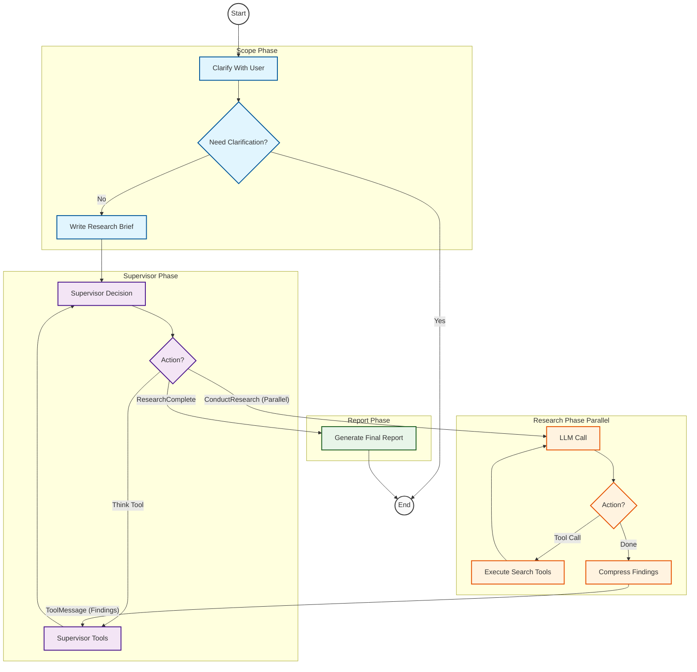

# Review

## Scope
确认研究范围

输入：AgentInputState（消息列表）
中间状态：AgentState
输出：research_brief

## Supervisor
发起研究

子研究主题可并行研究

## Reseach Agent 
搜索，总结，输出研究结果

输入：研究主题消息
中间状态：ResearcherState
输出：研究结果消息

## 提示词技巧

1. 提示大模型今天的日期
2. 结构化输出，json输出
3. 用markdown语法输入输出
4. 提示大模型首先查询官方网站
5. 提示词需要良好的结构
6. XML 标签隔离与模块化 (XML Tagging & Modularity)
7. 显式思维链引导 (Explicit Chain of Thought)
8. 硬性预算与停止条件 (Hard Constraints & Budgeting)
9. 少样本学习与反例教学 (Few-Shot & Negative Prompting)
10. 跨语言一致性强制 (Cross-Language Consistency)
11. 角色沉浸 (Role Immersion)

## 新的认识

1. research_agent_scope中clarify_with_user会在澄清用户问题时走向End,需要用InMemorySaver在内存中保存之前信息

### 流程图

